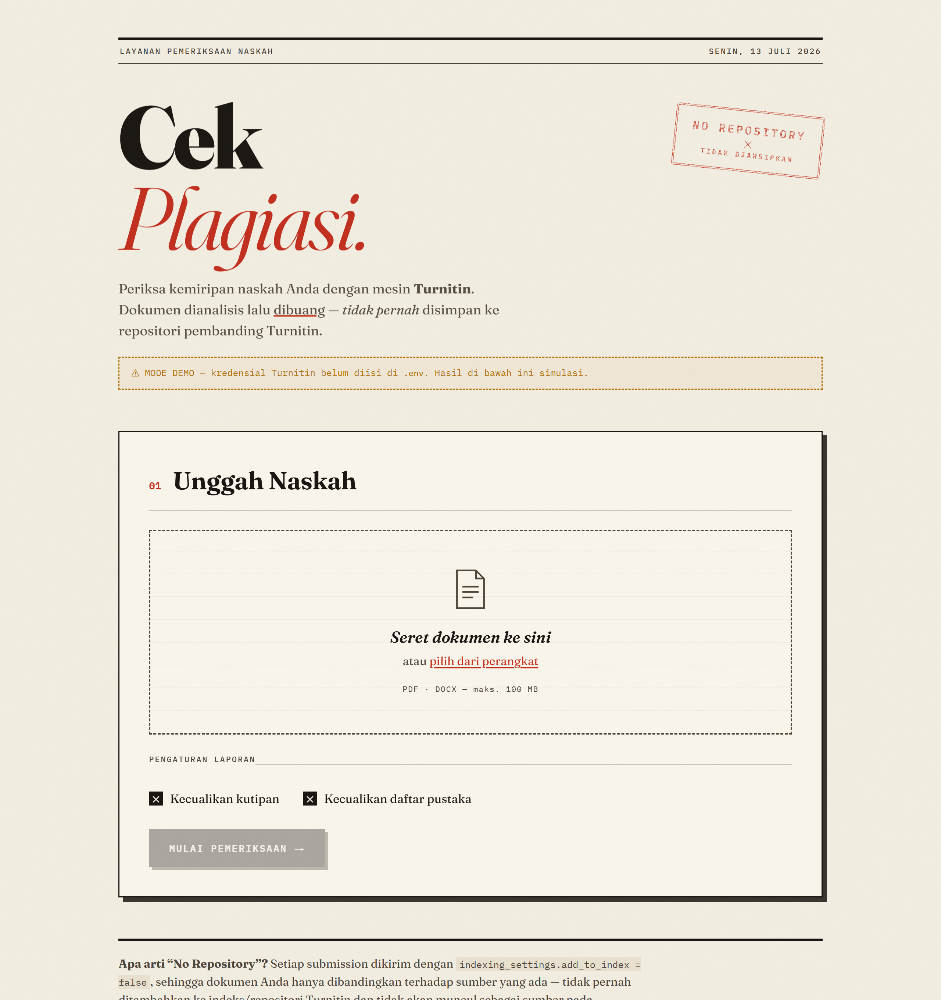

<h1 align="center">📄 Cek Plagiasi Turnitin — Cek Similarity Online (No Repository)</h1>

<p align="center">
  <b>Website cek plagiasi online berbasis Turnitin API</b> untuk memeriksa tingkat kemiripan
  (similarity) dokumen <b>PDF & DOCX</b> — dokumen dianalisis lalu dibuang,
  <b>tidak pernah disimpan atau diindeks</b> ke repositori Turnitin.
</p>

<p align="center">
  
  
  
  
  
</p>

<p align="center">
  
</p>

> **Kata kunci:** cek plagiasi · cek plagiasi turnitin · cek plagiasi online · cek similarity ·
> turnitin api · plagiarism checker · cek plagiat skripsi · similarity checker gratis.

---

## ✨ Tentang Web Ini

**Cek Plagiasi Turnitin** adalah aplikasi **web cek plagiasi online** untuk memeriksa tingkat kemiripan (similarity) sebuah naskah — cocok untuk **skripsi, tesis, jurnal, dan makalah** — terhadap sumber di internet, publikasi ilmiah, dan karya lain, menggunakan mesin **Turnitin** melalui Turnitin Core API (TCA). Cukup unggah dokumen **PDF atau DOCX**, dan sistem menampilkan skor kemiripan beserta rincian sumbernya.

Yang membedakan aplikasi ini: setiap dokumen dikirim dengan mode **NO REPOSITORY**. Artinya dokumen Anda **hanya dibandingkan** terhadap sumber yang sudah ada, tetapi **tidak ditambahkan** ke indeks/repositori Turnitin. Naskah Anda tidak akan pernah muncul sebagai "sumber pembanding" pada pemeriksaan orang lain di kemudian hari.

Secara teknis, ini dijamin dengan mengirim parameter berikut saat meminta laporan:

```json
{ "indexing_settings": { "add_to_index": false } }
```

dan **tidak pernah** memanggil endpoint pengindeksan Turnitin.

---

## 🚀 Fitur

- 📤 **Upload drag-and-drop** — hanya PDF & DOCX (maks. 100 MB)
- 🔒 **Mode No Repository** — dokumen tidak diarsipkan ke Turnitin
- ⚙️ **Opsi laporan** — kecualikan kutipan & daftar pustaka
- 📊 **Skor kemiripan** keseluruhan + rincian per sumber (internet / publikasi / karya lain)
- 🔗 **Buka laporan lengkap** di Turnitin Similarity Viewer
- 📥 **Unduh PDF** laporan resmi Turnitin
- 🎭 **Mode demo otomatis** — bila API key belum diisi, aplikasi tetap jalan dengan hasil simulasi (untuk mencoba tampilan)

---

## 🖥️ Teknologi

| Bagian    | Teknologi                          |
| --------- | ---------------------------------- |
| Backend   | Node.js + Express                  |
| Upload    | Multer                             |
| API       | Turnitin Core API (TCA)            |
| Frontend  | HTML + CSS + JavaScript (tanpa framework) |

---

## 📦 Cara Menjalankan

Pastikan **Node.js versi 18 atau lebih baru** sudah terpasang.

```bash
# 1. Clone repositori
https://github.com/NikeeTXC/cek-plagiasi-turnitin.git
cd cek-plagiasi-turnitin

# 2. Install dependencies
npm install

# 3. Siapkan file konfigurasi
cp .env.example .env      # Windows: copy .env.example .env

# 4. Jalankan
npm start
```

Buka browser ke **http://localhost:3000**

> 💡 Tanpa mengisi `.env`, aplikasi langsung berjalan dalam **mode demo** (hasil simulasi). Cocok untuk mencoba tampilan sebelum punya API key.

---

## 🔑 Cara Mengisi `.env`

Salin `.env.example` menjadi `.env`, lalu isi nilai berikut:

```env
TCA_BASE_URL=https://namatenant.turnitin.com
TCA_API_KEY=masukkan-api-key-anda-di-sini
TCA_OWNER_ID=pemilik-utama
PORT=3000
```

### Penjelasan tiap variabel

| Variabel        | Wajib? | Keterangan                                                                                          |
| --------------- | :----: | --------------------------------------------------------------------------------------------------- |
| `TCA_BASE_URL`  |   ✅   | URL *tenant* Turnitin institusi Anda, **tanpa** garis miring di akhir. Contoh: `https://kampusanda.turnitin.com` |
| `TCA_API_KEY`   |   ✅   | Kunci API rahasia dari admin console Turnitin (lisensi TCA / iThenticate v2)                         |
| `TCA_OWNER_ID`  |   ⬜   | Teks bebas sebagai identitas pemilik dokumen (mis. `admin-kampus`). Cukup dibiarkan default.         |
| `PORT`          |   ⬜   | Port server. Default `3000`.                                                                        |

> Selama `TCA_BASE_URL` **atau** `TCA_API_KEY` masih kosong, aplikasi berjalan dalam **mode demo**.

### Cara mendapatkan `TCA_BASE_URL` & `TCA_API_KEY`

Turnitin Core API adalah layanan **berbayar/berlisensi** — tidak ada API key gratis, dan akun Turnitin biasa (dosen/mahasiswa) **tidak** menyediakan API key. Untuk mendapatkannya:

1. **Melalui institusi Anda** — jika kampus/kantor sudah berlangganan Turnitin, minta admin Turnitin di sana untuk:
   `Admin Console → Integrations → New Integration → generate API key`.
   Admin akan memberikan **tenant URL** (`TCA_BASE_URL`) dan **API key** (`TCA_API_KEY`).
2. **Menghubungi Turnitin langsung** — untuk lisensi TCA / iThenticate v2 komersial.
   Dokumentasi resmi: <https://developers.turnitin.com/>

Setelah `.env` terisi dan server di-restart, banner "MODE DEMO" pada halaman akan hilang — tanda aplikasi sudah terhubung ke Turnitin sungguhan.

---

## 🗂️ Struktur Proyek

```
.
├── server.js           # Backend Express + klien Turnitin Core API
├── public/
│   ├── index.html      # Halaman utama
│   ├── style.css       # Gaya "arsip kertas & stempel"
│   └── app.js          # Logika upload, polling status, tampilan hasil
├── .env.example        # Template konfigurasi
├── package.json
└── README.md
```

---

## 🔐 Keamanan

- File `.env` berisi kredensial rahasia dan **sudah diabaikan** oleh `.gitignore` — jangan pernah meng-commit-nya ke GitHub.
- Jangan membagikan `TCA_API_KEY` Anda kepada siapa pun atau menaruhnya di kode sumber.

---

## 📜 Lisensi

Dirilis di bawah lisensi **MIT**. Silakan gunakan dan modifikasi.

> Turnitin® adalah merek dagang milik Turnitin, LLC. Proyek ini tidak berafiliasi
> secara resmi dengan Turnitin dan hanya memanfaatkan API publik mereka.
